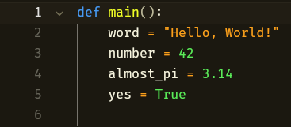
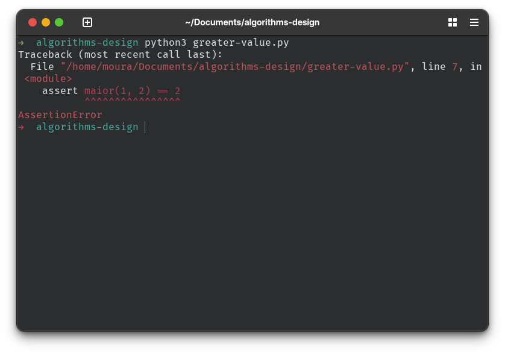

# Introdução a programação

Se você nunca escreveu uma linha de código na vida, então essa trilha é
definitivamente para você. Caso você já tenha uma certa experiência com
programação e no design de algoritmos, mesmo que você talvez conheça boa parte
dos métodos, recomendo ir direto para
[seção de como projetar algoritmos](#como-projetar-algoritmos), lá é
explicado conceitos mais profundos no desenvolvimento de algoritmos.

## Estudar linguagem de programação não é aprender a programar

Talvez o método funcione para alguns estudantes, no entanto, ensinar as
características e sintaxe de uma linguagem de programação não é exatamente
estudar a metodologia de se projetar algoritmos. O principal fato chave disso
não ser uma abordagem recomendada é que ignora completamente os fundamentos
necessários que todas as linguagens de programação compartilham entre si,
criando então um conhecimento limítrofe de programação. Portanto, é
importante absorver os conceitos básicos para que seja possível a aplicação em
diferentes contextos ou linguagens de programação.

## ALGORITMOS

Título bem exagerado, mas há uma boa razão pra isso. Algoritmos são o objeto
central do estudo de ciência da computação, assim como também em outros
aspectos do cotidiano, apenas com outra nomenclatura. Informalmente falando, um
algoritmo é uma sequência de passos que almejam atingir um determinado objetivo.
Algoritmos possuem as seguintes propriedades:

- **São organizados de forma lógica**: Para melhor exemplificar isso pense no
  simples processo de ligar um computador.
- **Devem terminar execução**: Um algoritmo mal projetado pode não finalizar,
  ou seja, um _loop_ (execução em círculo) eterno. Isto pode ocorrer por causa da
  negligência da organização lógica do algoritmo, incluindo a própria lógica
  (ou prova real) do algoritmo.
- **Devem resolver o problema proposto**: O algoritmo deve ser capaz de
  resolver o problema proposto, dado que está bem definido e é provado que o
  algoritmo finaliza. Há exceções, já que nem sempre algoritmos podem ser
  expressados para resolver alguns certos problemas ou os resultados podem não ser
  um dos mais precisos (veja
  [aqui](https://www.britannica.com/science/NP-complete-problem)).

### Representações Algorítmicas

- **Pseudocódigo**: Muito semelhante a uma linguagem de programação por causa de
  sua estrutura. Não existe um padrão definido para esta representação de
  algoritmos.
- **Fluxograma**: Figuras são usadas para representar algoritmos. Possuem um
  padrão de representação. Sua principal utilidade é no projeto de desenvolvimento
  de algoritmos.
- **Descrição objetiva**: É parágrafos em uma língua comum
  (e.x português por exemplo). Útil em algoritmos levemente pequenos, grandes
  algoritmos pode transformar esta abordagem mais incômoda.

O que foi descrito até agora, remete a ideia de algoritmos que seguem uma linha
reta, isto é, sem quebra de corrente de execução dos algoritmos. No entanto,
algoritmos reais tendem a quebrar a corrente de execução com uma certa
frequência, incluindo **repetir** certos passos dada determinada **condição**.

- **se-senão (if-else)**: Determina procedimentos específicos a serem
  executados caso a **condição** seja atendida.

  ```py
  a = 12
  b = 32

  # Escreva no terminal o valor de a caso a seja igual a 12
  if (a == 12):
      print(a)
  else:
      print("O valor não era 12")
  ```

- **Laços de repetição**: Determina procedimentos específicos a serem
  executados repetidamente de acordo com uma **condição**

  ```py
  # Variável contadora
  var_contador = 0

  # Será escrito na tela "AHAHAHAHAHAHAHAAHAHHAHAHAHA"
  # enquanto o contador for menor que 10
  while (var_contador < 10):
      print("AHAHAHAHAHAHAHAAHAHHAHAHAHA")

      # Acrescenta um ao contador. Essencial para que o algoritmo não esteja
      # preso em um círculo infinito (loop infinito)
      var_contador = var_contador+1
  ```

## Como projetar algoritmos

Em conceitos futuros de engenharia de software, é visto que um bom sistema de
software possui um processo bem definido de desenvolvimento. Algo similar ocorre
no projeto de algoritmos. Portanto nas seções a seguir, veremos uma espécie de
receita para diferentes desafios em projeto de algoritmos.

### Requisitos

Por razões de simplicidade e disponibilidade de recursos, a linguagem Python
será usada para descrever o processo de projeto de algoritmos. Claro, o
propósito é de ensinar como escrever algoritmos, e algoritmos podem ser
expressados em diferentes linguagens de programação, portanto sinta-se livre
para usar o método com qualquer linguagem. Por hora, será utilizado Python[^1].

### Dados Fixos

Dados são um ponto importante em qualquer algoritmo. Eles são os valores que
serão manipulados pelo algoritmo. Eles podem ser de diferentes tipos, como
números, strings e booleanos. E claro, como são diferentes tipos de
dados, eles podem ser manipulados de diferentes formas. Por exemplo, números
podem ser somados, subtraídos, multiplicados e divididos, enquanto strings podem
ser concatenadas, divididas e substituídas. De forma geral, estes tipos de dados
são **atômicos**, ou seja, não podem ser divididos em partes menores.

<figure>
    
    <figcaption>
        Os variados tipos de dados atômicos na linguagem Python.
    </figcaption>
</figure>

### Como projetar funções

As funções, ou subrotinas, são transformadores de dados. Elas recebem um ou mais
dados como entrada e retornam um ou mais dados como saída. Normalmente, elas são
usadas para dividir um problema em partes menores e mais gerenciáveis. Esta
pequena trilha lhe demonstrará um passo-a-passo simples de entender de como
projetar funções.

1. **_Defina o problema que você quer resolver_** Este é o principal passo para
a escrita do algoritmo. Essencialmente, estaremos descrevendo da forma mais
simples mas direta possível o que o algoritmo deve nos retornar. A importância
desta etapa é que ela nos ajuda a entender o problema de forma mais clara e
direta, o que facilita a escrita do algoritmo.
2. **_Defina os dados que serão manipulados pelo algoritmo_** Nesta fase,
extrairemos as informações necessárias para resolver o problema. Isso pode
incluir dados de entrada, dados intermediários e dados de saída. Esta etapa é
muito dependente do primeiro passo, dado que o problema definido na primeira
etapa determina quais dados serão necessários[^2] para resolver o problema.
3. **_Prepare um esboço inicial da função_** O esboço inicial da função é
simplesmente a definição de uma função, que inclui o nome da função, os
parâmetros de entrada e o tipo de retorno. É interessante que a função retorne
um valor padrão correspondente ao tipo de retorno definido, especialmente para
o passo a seguir.
4. **_Prepare testes para a função_** Este é um dos fundamentos importantes não
apenas no projeto de algoritmos, mas também em diversas áreas do campo de
ciência da computação. É essencialmente a etapa onde provemos maneiras de provar
que a função esteja correta. Assim, como os passos anteriores, os testes que
você definir dependem muito do tipo de dado retornado e do que o problema está
pedindo.
5. **_Escreva o código template_** Este passo final é onde colocaremos código
padrão referente ao tipo de dado trabalhado pela função. É importante
salientar: diferentes tipos de dados requerem diferentes abordagens de
implementação.
6. **_Preencha as lacunas com a implementação do algoritmo_** Esta é a fase
final onde podemos finalmente "tapar os buracos" com a implementação do
algoritmo. Com isso restando apenas a testagem da função.

> [!NOTE]
> Para problemas super triviais como simples adições de números, a receita pode
ser um pouco massante de aplicar no algoritmo. No entanto, se você nunca fez
algoritmos, é preferível que siga a receita a risca, dado que é necessário
obter esta importante habilidade.

### Aplicando a receita: Qual o maior número

A seguir, vamos aplicar a receita para criar uma função que retorna o maior
número entre dois valores. Se você já escreveu código, você sabe que isto é
um problema simples, mas é importante seguir a receita para entender o processo
completo.

Vamos começar com o primeiro passo: documentar a função. Neste caso, a descrição
do problema é mais que suficiente para servir como documentação da função.

```py
"""Dado a e b, retorne o maior valor"""
```
Dado essa descrição, podemos inferir duas coisas, estas essenciais para a
solução do problema:
1. O tipo de dados que a função deve manipular é numérico.
2. A função deve retornar um valor numérico.
Tendo estas observações em mente, podemos montar a definição inicial da função:

```py
# Note como a nome da função é condizente com o problema.
# Dar nomes significativos é imprescindível para a legibilidade e manutenção
# do código.
def maior(a, b):
    """Dado a e b, retorne o maior valor"""

    # Retornamos 0 como valor inicial, apenas por questões de completude.
    return 0
```

Com a implementação inicial definida, podemos então definir uma série de testes
para validar o funcionamento da função. Ao escrever os testes, é importante
considerar os diferentes cenários que a função testada pode encontrar. Por
exemplo, em nosso problema proposto, temos as seguintes situações:

+ Quando os valores são iguais, o maior valor é o próprio valor.
+ Quando os valores são diferentes, o maior valor é o maior entre eles.

Tendo isso em mente, podemos escrever os testes para validar a função. Há várias
formas testar código[^3], mas por questões de simplicidade usaremos declarações
`assert`.

```py
def maior(a, b):
    """Dado a e b, retorne o maior valor"""

    return 0


assert maior(1, 2) == 2
assert maior(27, 12) == 27
assert maior(1, 1) == 1
```

É essencial rodarmos o código para garantir que o nosso programa está bem
formado e funcional. Acostume-se a fazer isso sempre que escrever código, não é
sempre que você estará seguindo a sintaxe correta. Ao executarmos o código,
devemos verificar se todos os testes passaram. Se algum teste falhar, significa
que há um erro no código que precisa ser corrigido.

<figure>
    
    <figcaption>
        AssertErrror significa que a função não atendeu aos requisitos
        esperados.
    </figcaption>
</figure>

Após isso, podemos trabalhar na implementação da função, levando em conta,
claro, os tipos dos valores de entrada e o que deve ser feito (documentação). O
trabalho de escrever código para dados atômicos é relativamente simples, dado
que já existe um conjunto de operações que podem ser usadas para computar estes
tipos de dados. Em nosso problema, estamos trabalhando com números, portanto,
além das operações matemáticas, podemos fazer comparações e operações lógicas.

```py
>>> 5 > 8
False
>>> 5 > 3
True
```

O nosso problema requer que façamos uma comparação entre estes dados e decidamos
se eles são iguais ou diferentes. Além disso, um diferentes resultado será
retornado dependendo de uma condição, portanto, é mais do que claro que teremos
que utilizar de uma declaração se-senão(if-else).

```py
def maior(a, b):
    """Dado a e b, retorne o maior valor"""

    if a > b:
        return a
    else:
        return b


assert maior(1, 2) == 2
assert maior(27, 12) == 27
assert maior(1, 1) == 1
```

Por fim, podemos finalmente executar os testes para garantir que a função está
funcionando corretamente. Se estiver correto, nenhum erro será retornado.

### Outros tipos de dados

Em seções anteriores, vimos como podemos escrever algoritmos sobre tipos de
dados atômicos. Há outra espécie de organização de dados que utilizamos para a
resolução de problemas mais específicos

* **_Itemizações_**. Um conjunto de diferentes tipos de dados que se referem um
determinado contexto cujo cada tipo de dado dentro da itemização possue um
significado próprio. Porexemplo, podemos definir **StatusDaBomba** como ou um
intervalo de números inteiros de 1 a 100 que significa tempo restante para
explodir ou _false_ para denotar que a bomba já explodiu.

* **_Enumerações_**. São os mais usados em designs de algoritmos pois são
essencialmente um conjunto de valores fixos que representam um contexto. Por
exemplo, podemos ter uma enumeração chamada **TipoDeCarro** que possue os
valores _SEDAN_, _SUV_, _ESPORTIVO_, _HOTHATCH_.

* **_Estruturas_**. São tipos compostos que podem ser usados para representar
dados complexos. Por exemplo, podemos ter uma estrutura chamada **Pessoa** que
possue os campos _nome_, _idade_ e _endereço_. Em Python podemos simplesmente
utilizar de definição de classes para representar estruturas.

* **_Autoreferenciais_**. São tipos recursivos que referem-se a eles mesmos.
Apesar de serem mais complexos e exigir mais raciocínio, eles são os mais
adequados para representar estruturas de dados complexas, como árvores, grafos e
listas encadeadas.

> [!NOTE]
> Classes e estruturas não são termos intercambiáveis. Classes são elementos
fundamentais do paradigma de orientação a objetos, enquanto estruturas são
elementos fundamentais do paradigma de programação estruturada. A principal
diferença está no fato de que estruturas não possuem comportamentos atribuídos
e muito menos conceitos fundamentais de POO como atribuição dinâmico de métodos,
herança e encapsulamento.

### Como projetar dados

Haverá momentos em que precisaremos projetar dados que são específicos a um
contexto, dado que as ferramentas não disponibilizam de uma solução pronta. Note
que, sempre que possível, utilize os tipos de dados que lhe são disponíveis; não
reinvente a roda. A receita para o projeto de dados é esta:

1. Analise o objeto principal de interação do algoritmo
2. Escolha uma organização para o tipo de dado projetado
3. Documente o tipo de dado projetado
4. Escreva um template para operar com o tipo de dado customizado

É um receita simples, mas o suficiente para te ajudar a resolver problemas cujo
contexto é desconhecido ou não é possível utilizar os tipos de dados
disponíveis.

Digamos que seja necessário elaborar um tipo de dado que represente a situação
de um foguete. Os cientistas precisam saber quando o foguete ainda está na
terra, quando estiver voando a uma altura x e quando pousou no chão. Note que no
problema citado, o contexto do foguete é citado claramente:

* O foguete pode estar na terra
* O foguete pode estar voando a uma altura x
* O foguete pode estar pousado no chão

Há três estados, e seria inviável a longo prazo representar este contexto
utilizando apenas tipos de dados atômicos. Podemos representar o estado do
foguete então como uma itemização, onde ela agrupa o contexto da seguinte forma:

* **`false`** é usado para representar quando o foguete ainda está na terra
* **`true`** é usado para representar quando o foguete já pousou no chão
* **um intervalo de valores inteiros** representam a altura atual do foguete

Temos então uma **itemização**, pois dados de diferentes tipos estão sendo
usados em conjunto para representar um contexto. Então podemos documentar este
tipo de dado da seguinte forma:

```python
"""Rocket é um destes valores
    False: Quando o foguete ainda está na terra
    Int: Quando o foguete está voando a uma altura x entre [0, 4000]
    True: Quando o foguete já pousou no chão
"""
```

Nosso tipo de dado está definido, mas algum algoritmo vai interagir com este
tipo de dado. E um programador pode usar a receita descrita anteriormente para
projetar um algoritmo trabalhando com este tipo de dado, portanto, precisamos
definir um template para algoritmos que trabalham com este tipo de dado. Para
definir um template, vamos definir uma função simples que recebe um valor do
tipo `Rocket` que contém a estrutura básica para interagir com este dado.

```python
def rocket_template(rocket):
    if isinstance(rocket, bool):
        ...
    elif isinstance(rocket, int) and 0 <= rocket <= 4000:
        ...
    else:
       # Informe valor inválido
```

Nas linhas de código acima, descrevemos o template para algoritmos que interagem
com o tipo `Rocket`, ou seja, uma itemização. O que fazemos na linha acima é uma
validação da entrada do tipo `Rocket`, dado que diferentes comportamentos são
esperados para cada caso. A checagem é feita utilizando a função `isinstance`,
que checa se o tipo do objeto é uma instância de um certo tipo.

### Como projetar aplicações

Coming Soon...

## Leitura recomendada

A seguir, será recomendado uma série de recursos úteis para aperfeiçoar o
conhecimento sobre desenvolvimento de algoritmos.

* [**_How to Design Programs_**](htdp-book): Boa parte do material aqui apresentado é
inspirado em seu conteúdo. O livro detalha conceitos importantes sobre como
projetar aplicações, algoritmos e estruturas de dados. Ele também disponibiliza
de pequenos exercícios para praticar os conceitos nele aprendidos. O livro
utiliza Racket com linguagem principal, mas os problemas podem ser resolvidos
utilizando de qualquer linguagem.

* [**_Introduction to Algorithms_**](algorithms-book): Este livro é uma
referência para o desenvolvimento de algoritmos. Ele aborda uma ampla gama de
algoritmos e estruturas de dados, além de fornecer uma introdução à análise de
algoritmos. Ele não é facilmente compreensível, dado que ele exige que você
tenha bons fundamentos matemáticos para analisar os algoritmos apresentados no
livro.


[^1]: [Veja como instalar o interpretador Python na sua máquina](https://www.python.org/downloads/).
[^2]: Em aplicações do mundo real, você verá que nem todos os dados são
convenientes para serem usados para certos contextos, por isso é muito
importante compreender o contexto do problema.
[^3]: O método preferível em situações real de produção de software é utilizar
suítes de testes automatizadas, como o
[`unittest`](https://docs.python.org/3/library/unittest.html) do Python.

[htdp-book]: https://htdp.org/
[algorithms-book]: https://www.amazon.com.br/Introduction-Algorithms-Fourth-Thomas-Cormen/dp/026204630X?dib=eyJ2IjoiMSJ9.gt_u6EMgNYiUTB3_eV66nHYldHnDsh3VK2_2aYG9RWrfUgoV9Cwg3GXStg93DN8Un75b_HNq13u48saU76Q6cuCHNRh_nATougA73Z-5hZO1cNzl50OFDQ0hYOvql7dlZqi_yPYX-bwPfmFU7ws5Dp7P9my2r3OBEktAU2mFmQjdseaVtytoePkAJPhDvRbgkV8FeG8p1EM7hXm1EhI-B6ri_A7OLmUQN2m5YUoghNdYVRmI6DKXo9JLErpflx7KsBaE0jvpwOuRsV09NbdULIbMeww_x3a2QyRy1LWUwHc.Yup-OoGwFkHYrsyma8bCMmtGyGmF7gMHfEQn3u8_tQw&dib_tag=se&keywords=data+structures+and+algorithms&qid=1745353177&sr=8-2&ufe=app_do%3Aamzn1.fos.25548f35-0de7-44b3-b28e-0f56f3f96147
