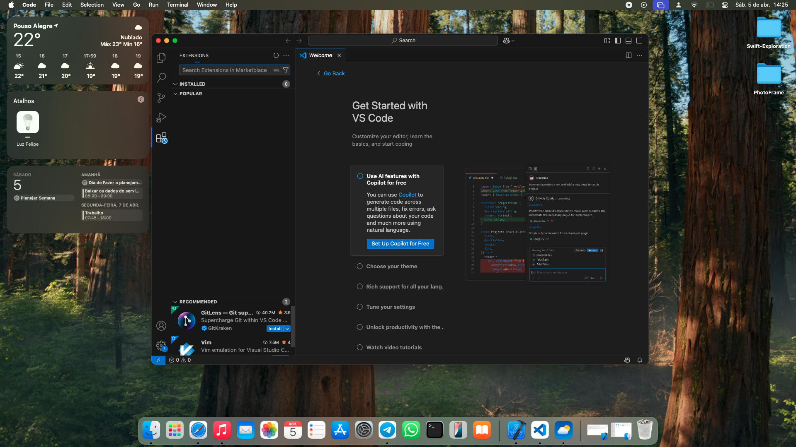
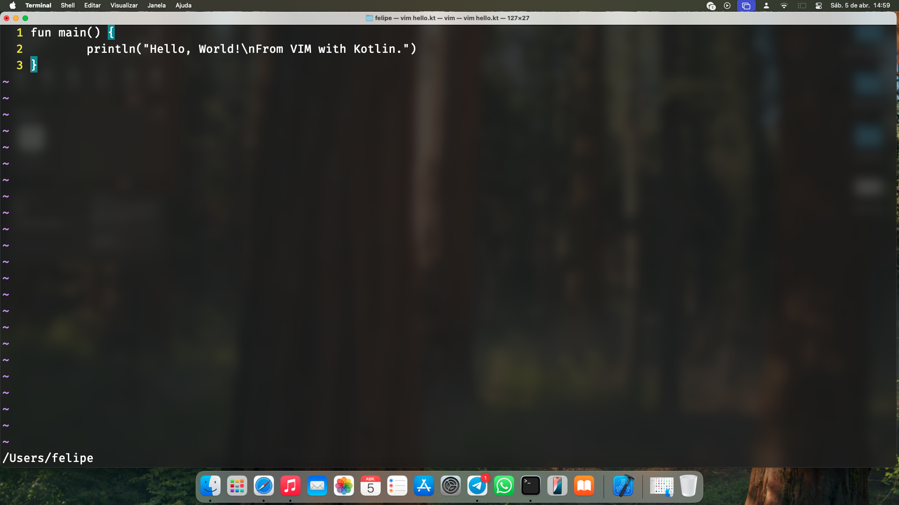
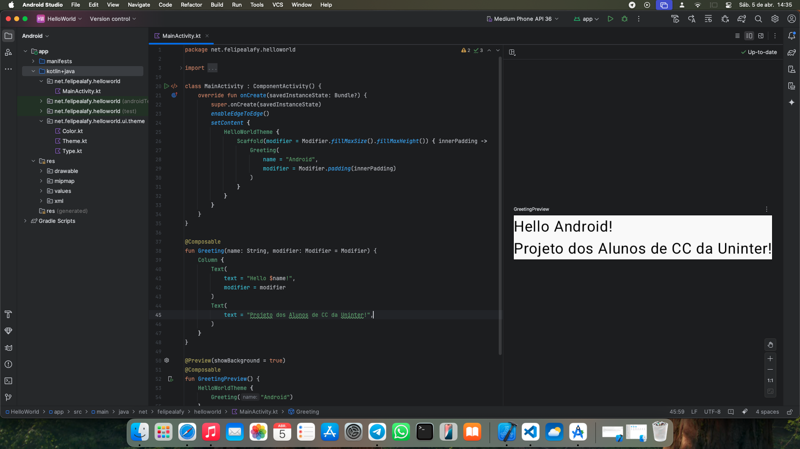
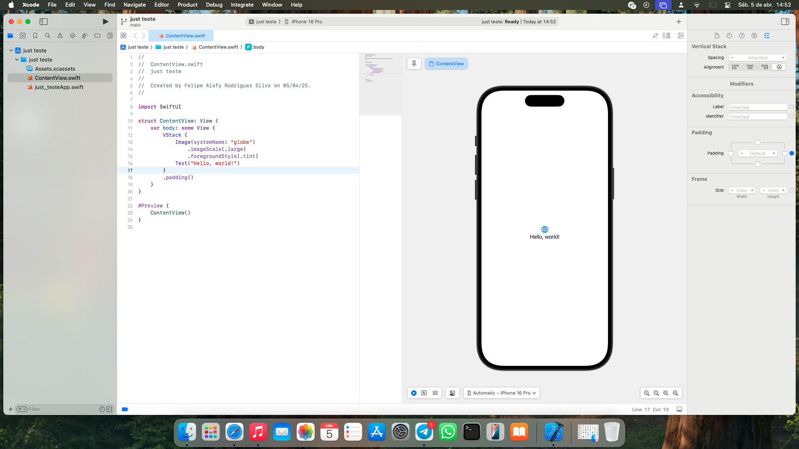

# Aprenda o que é uma IDE e aventure-se neste mundo das ferramentas de desenvolvimento

## O que é uma IDE

 IDE é uma sigla em inglês que quer dizer *Integrated Development Environment*, ou em bom português, Ambiente de Desenvolvimento Integrado.

 Podemos considerar uma IDE como um conjunto unificado de ferramentas de programação, no qual temos acesso fácil a um editor de código, um terminal, um gerenciador de versões como Git e, claro, a gestão facilitada de compilação de código.

---

## O passado do desenvolvimento
 Nós, programadores, sabemos que o passado da computação estava ligado à elétrica e à matemática, com máquinas de propósito específico criadas para realizar uma única tarefa. Desde que os conceitos de computadores modernos surgiram com Alan Turing, Von Neumann e Konrad Zuse, surgiu a necessidade de simplificar e facilitar a criação de software.

 Ferramentas de compilação de código apareceram junto com as linguagens de programação, como o Fortran e o compilador de Grace Hopper.

 Chegamos à era dos computadores pessoais, quando eles deixaram de ser exclusivos do exército e das universidades, passando a estar presentes em empresas e nas casas dos consumidores finais.

 Com isso, iniciou-se uma nova era de softwares voltados para facilitar a utilização pelo usuário final. Nesse contexto, surgiram editores de texto como VI, VIM, Nano e Emacs, criados para facilitar o desenvolvimento de software.

 Muitos desses editores trazem uma função essencial: a capacidade de serem expandidos com plugins.

 Também surgiram o Git, Subversion, CVS e Mercurial, que são ferramentas de gestão de versões de código, sendo o Git a mais popular e atemporal.

 Ao unir essas estruturas, criam-se as IDEs, nas quais a maioria apresenta recursos básicos como gerenciador de arquivos embutido, editor de texto e terminal. Algumas também oferecem plugins, Git integrado de forma gráfica, capacidade de programação colaborativa, com duas pessoas editando o mesmo arquivo remotamente ao mesmo tempo, e até gerenciamento de containers Docker.

---

## Principais IDEs
### Visual Studio Code - VS Code
- Um dos preferidos dos programadores, o VS Code tem a característica de ser simples por padrão, mas poderoso quando bem customizado. 

- Entre as plataformas suportadas estão Windows, Linux e macOS.
- Principais características:
  * Explorador de arquivos;
  * Customização fácil com extensões e temas;
  * Generalista, compatível com a maioria das linguagens de programação, graças às extensões;
  * Integração com Git;
  * Leve;
  * Possibilidade de integração com IA para autocompletar código;
  * Gerenciamento de containers Docker com extensões.

### IntelliJ IDEA
- É uma das famosas IDEs da empresa JetBrains, responsável pelo que muitos consideram a melhor família de IDEs dos últimos tempos, sendo a principal delas o IntelliJ IDEA.
- Originalmente pensado para desenvolvimento em Java, o IntelliJ hoje é capaz de rodar Kotlin, Groovy e Scala de forma nativa e *out-of-box*.
- A JetBrains conta com várias outras IDEs especializadas, como:
  * PyCharm: Para desenvolvimento em Python;
  * WebStorm: Para desenvolvimento Front-End;
  * PhpStorm: Para desenvolvimento em PHP;
  * CLion: Para C e C++;
  * DataGrip: Para realizar queries em SQL;
  * Goland: Para desenvolvimento em Go;
  * RubyMine: Para desenvolvimento em Ruby;
  * RustRover: Para desenvolvimento em Rust;
  * Rider: Para desenvolvimento em .NET e C#, facilmente integrável com Game Engines como Unity, Unreal Engine e Godot.

- Entre as características das ferramentas da JetBrains estão:
  * Integração com Git;
  * Explorador de arquivos do sistema operacional;
  * Sistema de debug completo;
  * Gerenciamento de ClassPaths e SDK;
  * Possibilidade de instalação de extensões;
  * Terminal integrado;
  * Configuração automática do *Run* da aplicação;
  * Desenvolvimento colaborativo com mais de uma pessoa editando o mesmo arquivo remotamente.

> [!TIP]
> Alunos da Uninter podem se inscrever no programa JetBrains Educational, que dá acesso a todas as IDEs da empresa gratuitamente. Para se cadastrar, basta ativar seu e-mail institucional nas configurações do Univirtus e utilizá-lo na criação da conta JetBrains.

🔗 Cadastre sua conta de estudante neste link [JetBrains Education](https://www.jetbrains.com/community/education/#students).

Para baixar as IDEs da JetBrains, dê preferência ao [ToolBox](https://www.jetbrains.com/toolbox-app/), que baixa e atualiza as IDEs automaticamente.

### Vi IMproved - VIM
- Para os amantes de terminal, temos o clássico VIM. Por ser uma ferramenta de código aberto, há muitos forks atualmente, e o recomendado é o NeoVIM, uma versão mais moderna e altamente configurável através da linguagem de programação LUA.

- Principais características do VIM:
  * Extremamente leve;
  * Rápido;
  * Compatível com a maioria dos sistemas operacionais;
  * Possivelmente a mais customizável entre todas mencionadas neste artigo;
  * Conta com inúmeros gerenciadores de pacotes para instalação de temas e extensões.

> [!NOTE]
> Veja como baixar o VIM para o seu sistema operacional [aqui](https://neovim.io).

### Android Studio
- Fruto do trabalho conjunto entre Google e JetBrains, além de criar o Kotlin, eles lançaram o Android Studio, a IDE mais pesada da história.

- Considerar o Android Studio pesado não é um exagero. A configuração mínima para rodar esta IDE e o Android Emulator simultaneamente inclui 8 GB de RAM, um processador com suporte à virtualização e pelo menos 20 GB de armazenamento. Porém, seus recursos justificam o tamanho, como:
  * Suporte para programação em Java e Kotlin;
  * Downloads automáticos de SDKs Android;
  * Configuração assistida de projetos Android;
  * Suporte a Git;
  * Gerenciador de arquivos embutido;
  * Emulador de Android integrado;
  * Renderização em tempo real da interface gráfica do aplicativo;
  * Gerenciador de dispositivos físicos e virtuais conectados ao computador;
  * Gerenciamento do Firebase embutido;
  * E todos os outros recursos presentes nas IDEs da JetBrains.

> [!NOTE]
> Você pode instalar o Android Studio pelo JetBrains [ToolBox](https://www.jetbrains.com/toolbox-app/) ou pelo site [Android Developers](https://developer.android.com/studio?hl=pt-br).

### XCode
*  Para desenvolvimento de aplicativos para dispositivos da Apple, temos o XCode. No entanto, ele é menos acessível, pois requer um computador Mac para ser utilizado, diferente das outras IDEs, que funcionam em praticamente qualquer sistema operacional.

- Principais características do XCode:
  * Desenvolvimento para iOS, macOS, Apple Watch, VisionOS, iPadOS, tvOS, etc;
  * Compatível com Swift;
  * Compatível com Objective-C;
  * Git integrado;
  * Gerenciador de arquivos integrado;
  * Terminal integrado;
  * Preview em tempo Real.

> [!NOTE]
> Para realizar o download, acesse a App Store no seu Mac ou no [site](https://developer.apple.com/xcode/).

---

🌎 Contribua para este artigo e adicione sua IDE favorita com suas características no mesmo formato apresentado acima.

---

## Contribuidores:
* Felipe Alafy Rodrigues Silva - Estudante de Ciência da Computação, faculdade UNINTER - Criação original do artigo.

* Gabriel de Moura - Estudante de Ciência da Computação, faculdade UNINTER - Revisão do artigo.

---

## Referências:
Ainda que este artigo tenha sido escrito sem referências em mente, como sugerido pelo @smolBlackCat, deixaremos alguns sites de referência para que você possa explorar e aprender ainda mais sobre as ferramentas do dia a dia.

* Histórias:
  - História da computção de maneira resumida pode ser encontrada [aqui](https://pt.wikipedia.org/wiki/História_da_computação) de maneira acessível para todos.

  - História de [Grace Murray Hopper](https://pt.wikipedia.org/wiki/Grace_Hopper) e seus feitos para a computação moderna.

* Ferramentas:
  - Conheça melhor o VS Code, no [site oficial](https://code.visualstudio.com) do projeto, explore a aba de extensões que eu garanto que você vai se supreender positivamente.

  - Conheça toda a linha de ferramentas da [Jetbrains](https://www.jetbrains.com).

  - Esta [Thread no StackExchange](https://vi.stackexchange.com/questions/388/what-are-the-differences-between-the-vim-plugin-managers) demonstra a existência de vários gerenciadores de pacotes para o NeoVIM.

  - Requistos para rodar o Android Studio podem ser encontrados [aqui](https://developer.android.com/studio/platform/install?hl=pt-br).

  - XCode [Conheça mais sobre está IDE](https://developer.apple.com/xcode/), veja a compatibilidade com seu computador.